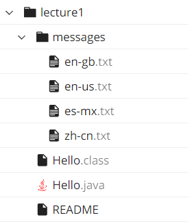

# Lab Report 1



*Note: The content of this lab report will refer to the above file hierarchy.*

***

## `cd`

### No arguments

Executing the `cd` command from the root directory `~/` and passing no arguments appears to have no effect:

```bash
[user@sahara ~]$ cd
[user@sahara ~]$ 
```

However, executing the `cd` command from a non-root directory provides more valuable insight into the command behavior:

```bash
[user@sahara ~/lecture1]$ cd
[user@sahara ~]$ 
```

```bash
[user@sahara ~/lecture1/messages]$ cd
[user@sahara ~]$ 
```

The above two examples demonstrate the default behavior of the `cd` command: executing the `cd` command and passing no arguments changes the working directory to the root directory `~/`.

### One argument: Directory

Executing the `cd` command and passing the path to a directory changes the working directory to the specified directory. The below example changes the working directory from `~/` to `~/lecture1`:

```bash
[user@sahara ~]$ pwd
/home
[user@sahara ~]$ cd lecture1/
[user@sahara ~/lecture1]$ pwd
/home/lecture1
```

*Note: The `pwd` command returns the working directory of the terminal. In the above example, `pwd` is used to explicitly check the working directory of the terminal and changes in the working directory. Although the working directory is present in the command prompt, [explicit is better than implicit](https://peps.python.org/pep-0020/#the-zen-of-python)!*

The directory path passed to the `cd` command can be either absolute or relative. Note how the following commands demonstrate the same behavior and both change the working directory from `~/lecture1/messages/` to `~/lecture1/`:

*Absolute*:

```bash
[user@sahara ~/lecture1/messages]$ pwd
/home/lecture1/messages
[user@sahara ~/lecture1/messages]$ cd ~/lecture1/
[user@sahara ~/lecture1]$ pwd
/home/lecture1
```

*Relative*:

```bash
[user@sahara ~/lecture1/messages]$ pwd
/home/lecture1/messages
[user@sahara ~/lecture1/messages]$ cd ../
[user@sahara ~/lecture1]$ pwd
/home/lecture1
```

### One argument: File

Executing the `cd` command and passing the path to a file attempts to change the working directory to the specified file. This is an invalid operation since the working directory must be a directory, not a file, so the `cd` command throws an error:

```bash
[user@sahara ~]$ cd lecture1/messages/en-us.txt
bash: cd: lecture1/messages/en-us.txt: Not a directory
```

## `ls`

### No arguments

Executing the `ls` command and passing no arguments lists all the directories and files that are children of the working directory:

```bash
[user@sahara ~]$ ls
lecture1
[user@sahara ~]$ cd lecture1/
[user@sahara ~/lecture1]$ ls
Hello.class  Hello.java  messages  README
[user@sahara ~]$ cd messages/
[user@sahara ~/lecture1/messages]$ ls
en-gb.txt  en-us.txt  es-mx.txt  zh-cn.txt
```

*Note: The returned items are listed in a modified [ASCIIbetical order](https://www.cs.cmu.edu/~pattis/15-1XX/common/handouts/ascii.html). The specific modifications to the usual ASCII order is dependent on the language being used by the terminal.*

### One argument: Directory

Executing the `ls` command and passing the path to a directory will list all the directories and files that are children of the specified path:

```bash
[user@sahara ~]$ ls lecture1/messages/
```

The argument passed to the `ls` command can be either absolute or relative. Note how the following commands demonstrate the same behavior and both list all the directories/files in `~/lecture1/`:

*Absolute*:

```bash
[user@sahara ~/lecture1/messages]$ ls ~/lecture1/
Hello.class  Hello.java  messages  README
```

*Relative*:

```bash
[user@sahara ~/lecture1/messages]$ ls ../
Hello.class  Hello.java  messages  README
```

*Note: Executing `$ ls ./` has the same behavior as executing `ls` and passing no arguments and is the default behavior of the `ls` command.*

### One argument: File

Executing the `ls` command and passing the path to a file echoes the specified path. If the path passed to the `ls` command is absolute, then the returned path will also be absolute; if the path passed to the `ls` command is relative, then the returned path will also be relative:

```bash
[user@sahara ~]$ ls lecture1/Hello.class
lecture1/Hello.class
[user@sahara ~]$ ls lecture1/messages/en-gb.txt
lecture1/messages/en-gb.txt
[user@sahara ~]$ cd lecture1/
[user@sahara ~/lecture1]$ ls messages/en-gb.txt
messages/en-gb.txt
[user@sahara ~/lecture1]$ cd messages/
[user@sahara ~/lecture1/messages]$ ls ../README
../README
[user@sahara ~/lecture1/messages]$ ls ~/lecture1/Hello.class
/home/lecture1/Hello.class
```

## `cat`

### No arguments

Executing the `cat` command and passing no arguments appears to cause the command to hang indefinitely:

```bash
[user@sahara ~]$ cat

```

In actuality, executing the `cat` command and passing no arguments reads from the standard input stream then outputs the contents of the standard input:

```bash
[user@sahara ~]$ cat
Hello World!    // User Input
Hello World!    // Command Output
CSE 15L         // User Input
CSE 15L         // Command Output

```

After executing the `cat` command, the user is able to type text into the terminal. Then, when the user presses <kbd>enter</kbd>/<kbd>return</kbd>, the terminal reads the text the user inputted and echoes it, outputting the same string of text to the terminal.

The `cat` command continues to read from the standard input and output its contents until the user terminates the command with <kbd>ctrl</kbd>+<kbd>C</kbd>/<kbd>cmd</kbd>+<kbd>C</kbd>.

### One argument: Directory

Executing the `cat` command and passing the path to a directory attempts to read the contents of the specified directory. This is an invalid operation, so the `cat` command throws an error:

```bash
[user@sahara ~]$ cat lecture1/
cat: lecture1/: Is a directory
```

### One argument: File

Executing the `cat` command and passing the path to a file prints the contents of the specified file.

```bash
[user@sahara ~]$ cat lecture1/README
To use this program:

javac Hello.java
java Hello messages/en-us.txt
```

The `cat` command functions whether given a plaintext or binary file. When the path to a plaintext file is passed, the text contents of the file are returned; when the path to binary file is passed, the binary contents of the file are returned:

```bash
[user@sahara ~]$ cat lecture1/Hello.class
����A2

java/lang/Object<init>()java/lang/String
  
  
  
  
java/nio/file/Pathof;(Ljava/lang/String;[Ljava/lang/String;)Ljava/nio/file/Path;
!java/nio/charset/StandardCharsetsUTF_8Ljava/nio/charse
t/Charset;
  
java/nio/file/Files
readStringB(Ljava/nio/file/Path;Ljava/nio/charset/Charset;)Ljava/lang/String;
 java/lang/SystemoutLjava/io/PrintStream;
"#$
%&java/io/PrintStreamprintln(Ljava/lang/String;)V(HelloCodeLineNumberTablemain([Ljava/lang/String;)V
Exceptions/java/io/IOException
SourceFile
Hello.java!')*��*+,)9*2����L�
```

---

# Relevant XKCD


