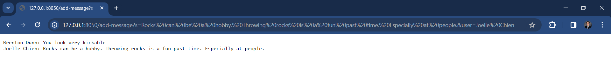

# Lab Report 2

---

# Chat Server

[src/report-2/ChatServer.java](https://github.com/JacobLee23/CSE-15L-Lab-Reports/blob/30a2430c27003af4c94e9cd175ba1d00e521d1c9/src/report-2/ChatServer.java)

## Compile/Run

```bash
$ cd src/report-2/
$ javac ChatServer.java Server.java
$ java ChatServer 8050
Server Started
```

## Message 1

* **Message**: *You look very kickable*
* **User**: Brenton Dunn
* **URL**: `http://127.0.0.1:8050/add-message?s=You%20look%20very%20kickable&user=Brenton%20Dunn`


Accessing the above URL calls the `Handler::handleRequest` method, passing for parameter `url` a `URI` object corresponding to the above URL:

```java
new URI("/add-message?s=You%20look%20very%20kickable&user=Brenton%20Dunn")
```

Prior to the `Handler::handleRequest` call, the field `Handler.messages` is a reference to an empty `ArrayList` object of `String` objects. 

As a result of this call to `Handler::handleRequest`, the `Handler.messages` field references an `ArrayList` object containing one `String` object:

```java
[
    "Brenton Dunn: You look very kickable"
]
```

## Message 2

* **Message**: *Rocks can be a hobby. Throwing rocks is a fun past time. Especially at people.*
* **User**: Joelle Chien
* **URL**: `http://127.0.0.1:8050/add-message?s=Rocks%20can%20be%20a%20hobby.%20Throwing%20rocks%20is%20a%20fun%20past%20time.%20Especially%20at%20people.&user=Joelle%20Chien`



Accessing the above URL calls the `Handler::handleRequest` method, passing for parameter `url` a `URI` object corresponding to the above URL:

```java
new URI("/add-message?s=Rocks%20can%20be%20a%20hobby.%20Throwing%20rocks%20is%20a%20fun%20past%20time.%20Especially%20at%20people.&user=Joelle%20Chien")
```

Prior to the `Handler::handleRequest` call, the field `Handler.messages` is a reference to an `ArrayList` object containing one `String` object:

```java
[
    "Brenton Dunn: You look very kickable"
]
```

As a result of this call to `Handler::handleRequest`, the `Handler.messages` field references an `ArrayList` object containing two `String` objects:

```java
[
    "Brenton Dunn: You look very kickable",
    "Joelle Chien: Rocks can be a hobby. Throwing rocks is a fun past time. Especially at people."
]
```

---

# SSH Keys


## Private Key


```bash
$ ls ~/.ssh/
id_ed25519  id_ed25519.pub  known_hosts

$ ls ~/.ssh/id_ed25519
/c/Users/JLpyt/.ssh/id_ed25519
```

The absolute path to the private key for the SSH key for logging into `ieng6` is `~/.ssh/id_ed25519` (or `C:\Users\JLpyt\.ssh\id_ed25519`).

## Public Key


```bash
$ ssh jal128@ieng6.ucsd.edu

-- SNIPPED --

[jal128@ieng6-201]:~:135$ ls .ssh/
authorized_keys
[jal128@ieng6-201]:~:136$ ls .ssh/authorized_keys
.ssh/authorized_keys
```

The absolute path to the public key for the SSH key for logging into `ieng6` is `.ssh/authorized_keys`.

## SSH Login


```bash
$ ssh jal128@ieng6.ucsc.edu

-- SNIPPED --

[jal128@ieng6-201]:~:55$ 
```

---

# Conclusion

In Labs 2 and 3, I learned the fundamentals of **Secure Shell Protocol (SSH)**, a concept I had previously heard of but never learned. I learned about connecting to the `ieng6` remote server via the `ssh` command and copying files between the local and remote filesystems via the `scp` command. Additionally, in those labs, I learned about the **client URL** (`curl`) command, another concept I had previously heard of but never learned, and using it to retrieve the HTML content of a web page via the URL of the page.

---

# Relevant XKCD


