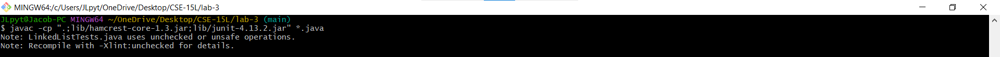
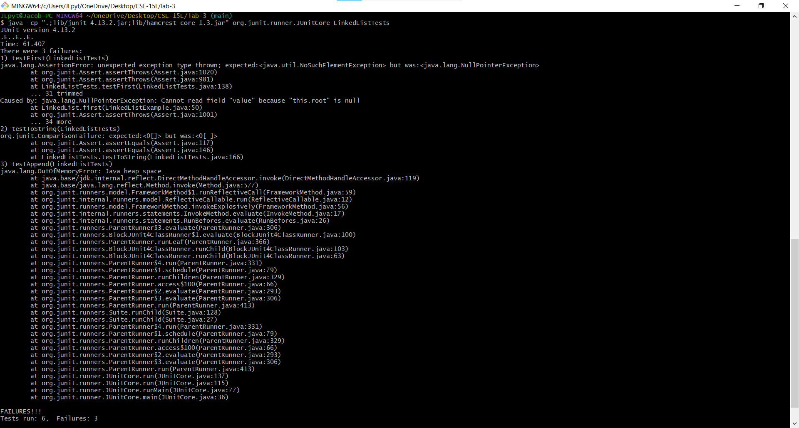

# Lab Report 3

---

# Bugs

## Source Code

[`src/report-3/LinkedListExample.java`](../src/report-3/LinkedListExample.java):

```java
class Node {
    
    int value;

    Node next;

    public Node(int value, Node next) {
        this.value = value;
        this.next = next;
    }
}
```

[`UCSD-CSE15L-F23/Lab3/LinkedListExample.java`](https://github.com/ucsd-cse15l-f23/lab3/blob/0638ac117175c34ced4a25b7dcc6a242874e9343/LinkedListExample.java):

```java
class LinkedList {

    Node root;

    public LinkedList() {
        this.root = null;
    }

    public void append(int value) {
        if (this.root == null) {
            this.root = new Node(value, null);
            return;
        }

        Node node = this.root;
        if (node.next == null) {
            node.next = new Node(value, null);
            return;
        }

        while (node.next != null) {
            node = node.next;
            node.next = new Node(value, null);
        }
    }
}
```

[`src/report-3/LinkedListTests.java`](../src/report-3/LinkedListTests.java):

```java
import static org.junit.Assert.*;

import java.util.ArrayList;
import org.junit.*;


public class LinkedListTests {

    int[] array0 = {};
    int[] array1 = { 0 };
    int[] array2 = { 1, 2, 3, 4, 5, 6, 7, 8, 9 };
    int[] array3 = { 1, 1, 2, 3, 5, 8 };
    int[] array4 = { -8, 8, -4, 4, -2, 2, -1, 1, 0 };
    int[][] arrays = { array0, array1, array2, array3, array4 };

    ArrayList<Integer>[] alists;

    LinkedList[] llists;

    @Before
    public void setUp() {
        this.alists = (ArrayList<Integer>[]) new ArrayList[this.arrays.length];
        this.llists = new LinkedList[this.arrays.length];

        for (int i = 0; i < this.arrays.length; ++i) {
            this.alists[i] = this.constructArrayList(this.arrays[i]);
            this.llists[i] = this.constructLinkedList(this.arrays[i]);
        }
    }

    public ArrayList<Integer> constructArrayList(int[] array) {
        ArrayList<Integer> list = new ArrayList<>();

        for (int x: array) {
            list.add(x);
        }

        return list;
    }

    public LinkedList constructLinkedList(int[] array) {
        Node node = null;

        for (int i = array.length - 1; i >= 0; --i) {
            node = new Node(array[i], node);
        }

        LinkedList list = new LinkedList();
        list.root = node;
        
        return list;
    }

    @Test
    public void testAppend() {
        for (int i = 0; i < this.arrays.length; ++i) {
            this.helpAppend(this.llists[i], this.alists[i]);
        }
    }

    public void helpAppend(LinkedList llist, ArrayList<Integer> alist) {
        llist.append(0);
        
        assertEquals(alist.size() + 1, llist.length());
        assertEquals(0, llist.last());
        
        Node node = llist.root;
        for (int i = 0; i < alist.size(); ++i) {
            assertEquals(Integer.toString(i), alist.get(i), (Integer) node.value);
            node = node.next;
        }
    }
}
```

## Passing Tests

The `testAppend` method only passes in two general cases:

1. An empty linked list (e.g., a `LinkedList` object constructed from `LinkedList.array0`)

    ```java
    public class LinkedListTests {

        ...

        @Test
        public void testAppendListEmpty() {
            int[] array = {};
            ArrayList<Integer> alist = this.constructArrayList(array);
            LinkedList llist = this.constructLinkedList(array);

            this.helpAppend(llist, alist);      // Passing Test
        }
    }
    ```

2. A linked list containing only one element (e.g., a `LinkedList` object constructed from `LinkedList.array1`)

    ```java
    public class LinkedListTests {

        ...

        @Test
        public void testAppendListOne() {
            int[] array = { 0 };
            ArrayList<Integer> alist = this.constructArrayList(array);
            LinkedList llist = this.constructLinkedList(array);

            this.helpAppend(llist, alist);      // Passing Test
        }
    }
    ```

## Failing Tests

The `testAppend` method fails in all other cases, for which the linked list contains more than one element (e.g., a `LinkedList` object constructed from `LinkedList.array2`, `LinkedList.array2`, `LinkedList.array3`, of `LinkedList.array4`):

```java
public class LinkedListTests {

    ...

    @Test
    public void testAppendListMultiple() {
        int[] array = { 1, 2, 3, 4, 5, 6, 7, 8, 9 };
        ArrayList<Integer> alist = this.constructArrayList(array);
        LinkedList llist = this.constructLinkedList(array);

        this.helpAppend(llist, alist);      // Failing Test
    }
}
```

## Symptoms

```bash
$ javac -cp ".;lib/hamcrest-core-1.3.jar;lib/junit-4.13.2.jar" *.java
...

$ java -cp ".;lib/junit-4.13.2.jar;lib/hamcrest-core-1.3.jar" org.junit.runner.JUnitCore LinkedListTests
...
```




When the `testAppend` method in [`src/report-3/LinkedListTests.java`](../src/report-3/LinkedListTests.java) is run, calling the `LinkedList.append` method, the Java Virtual Machine throws a `java.lang.OutOfMemoryError` indicating that the JVM ran out of heap space.

## Debugging/Diff

**Before** ([`UCSD-CSE15L-F23/Lab3/LinkedListExample.java`](https://github.com/ucsd-cse15l-f23/lab3/blob/0638ac117175c34ced4a25b7dcc6a242874e9343/LinkedListExample.java)):

```java
public void append(int value) {
    if (this.root == null) {
        this.root = new Node(value, null);
        return;
    }

    Node node = this.root;
    if (node.next == null) {
        node.next = new Node(value, null);
        return;
    }

    while (node.next != null) {
        node = node.next;
        node.next = new Node(value, null);
    }
}
```

Comparing the nature of the exception thrown by the Java Virtual Machine (that the program execution ran out of heap memory space while calling `LinkedList.append`) with the nature of the `LinkedList.append` method (the presence of a `while` loop) suggests that the `LinkedList.append` entered an infinite loop while continuing to instantiate new objects while in the loop, causing `java.lang.OutOfMemoryError` to be thrown. A close examination of the behavior of the `while` loop provides insight into the cause of the `java.lang.OutOfMemoryError`.

Consider a linked list containing the elements `X`, `Y`, and `Z`, for which the variable `node` points to the root node (`X`):

```
X (ROOT) -> Y -> Z -> null
```

Let the element being appended to the end of the linked list be `A`.

Before entering the `while` loop:

```
X (ROOT) -> Y -> Z -> null
^
node
```

After the first iteration:

```
X (ROOT) -> Y -> A -> null
            ^
            node
```

After the second iteration:

```
X (ROOT) -> Y -> A -> A -> null
                 ^
                 node
```

After the third iteration:

```
X (ROOT) -> Y -> A -> A -> A -> null
                      ^
                      node
```

Instead of traversing the linked list to the tail node and appending the element to the end of the node, the loop first truncates the list after the element at index 1 the indefinitely appends the new element to the end of the list.

The loop should instead first iterate to the end of the linked list then second append the element to the end of the list, which can be accomplished by moving the line `node.next = new Node(value, null)` outside the `while` loop.

**After** ([`src/report-3/LinkedListExample.java`](../src/report-3/LinkedListExample.java)):

```java
public void append(int value) {
    if (this.root == null) {
        this.root = new Node(value, null);
        return;
    }
    
    Node node = this.root;
    while (node.next != null) {
        node = node.next;
    }
    node.next = new Node(value, null);
}
```

---

# The `grep` Command

Source: [`grep` Documentation](https://www.gnu.org/software/grep/manual/grep.html)

```bash
$ grep --help
Usage: grep [OPTION]... PATTERN [FILE]...
Search for PATTERN in each FILE or standard input.
PATTERN is, by default, a basic regular expression (BRE).
Example: grep -i 'hello world' menu.h main.c
```

The `grep` command searches for a text pattern `PATTERN` in a file `FILE`. The default behavior of the `grep` command uses the `-G` option, which interpets `PATTERN` as a basic regular expression when searching for `PATTERN` in `FILE`, where metacharacters (e.g., `.`, `*`, `?`) are treated according to their literal role instead of their meta role.

For the below examples, `filename.txt` has the corresponding contents:

```bash
$ cat filename.txt
foo
bar
baz
spam
eggs
bacon
```

*Note: the `cat` command is used in the below examples to print the output of `grep` to `STDOUT`.*

## `-E`/`--extended-regexp`

The `-E` options interprets `PATTERN` as an exetended regular expression when searching for `PATTERN` in `FILE`. Metacharacters are treated according to their meta role instead of their literal role.

```bash
$ grep -E "\w{,4}" filename.txt | cat
foo
bar
baz
spam
eggs
bacon

$ grep -E "(\w)\1" filename.txt | cat
foo
eggs
```

The `egrep` command is synonymous to `grep -E`:

```bash
$ egrep "\w{,4}" filename.txt | cat
foo
bar
baz
spam
eggs
bacon

$ egrep "(\w)\1" filename.txt | cat
foo
eggs
```

Source: [GNU Grep 3.11 | 2.4 `grep` Programs](https://www.gnu.org/software/grep/manual/grep.html#grep-Programs-1)

## `-F`/`--fixed-strings`

The `-F` options interprets `PATTERN` as a literal string when searching for `PATTERN` in `FILE`. Metacharacters are treated according to their literal role instead of their meta role.

```bash
$ grep -F a filename.txt | cat
bar
baz
spam
bacon

$ grep -F b filename.txt | cat
bar
baz
bacon
```

The `fgrep` command is synonymous to `grep -F`:

```bash
$ fgrep a filename.txt | cat
bar
baz
spam
bacon

$ fgrep b filename.txt | cat
bar
baz
bacon
```

Source: [GNU Grep 3.11 | 2.4 `grep` Programs](https://www.gnu.org/software/grep/manual/grep.html#grep-Programs-1)

## `-f`/`--file=FILE`

Passing `-f` and the name of a file causes `grep` to read a regular expression pattern from a file and use it to parse `FILE`:

```bash
$ cat regex1.txt
\w{,4}

$ grep -E -f regex1.txt filename.txt | cat
foo
bar
baz
spam
eggs
bacon

$ cat regex2.txt
(\w)\1

$ grep -E -f regex2.txt filename.txt | cat
foo
eggs
```

Source: [GNU Grep 3.11 | 2.1.2 Matching Control](https://www.gnu.org/software/grep/manual/grep.html#Matching-Control-1)

## `-i`/`--ignore-case`

Passing `-i` causes `grep` to ignore any casing when searching for `PATTERN` in `FILE`:

```bash
$ grep -i foo filename.txt | cat
foo

$ grep -i FOO filename.txt | cat
foo
```

Source: [GNU Grep 3.11 | 2.1.2 Matching Control](https://www.gnu.org/software/grep/manual/grep.html#Matching-Control-1)

## Citations

grep. GNU Grep 3.11. (n.d.). https://www.gnu.org/software/grep/manual/grep.html 

---

# Relevant XKCD


