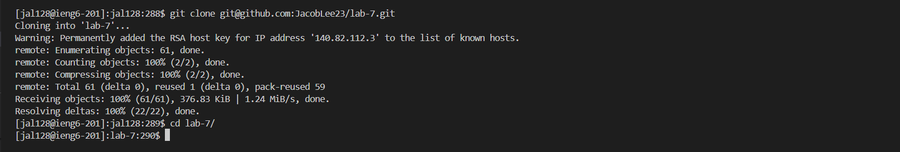
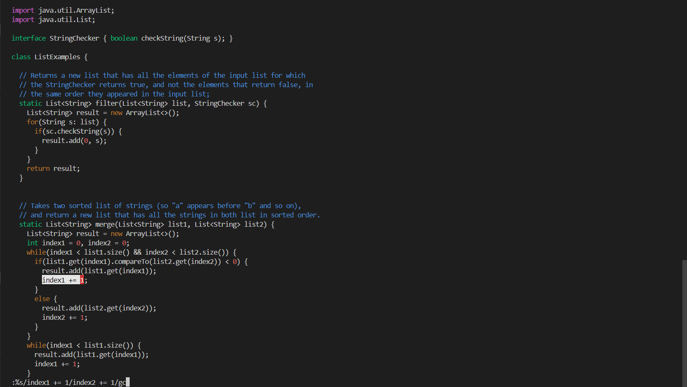
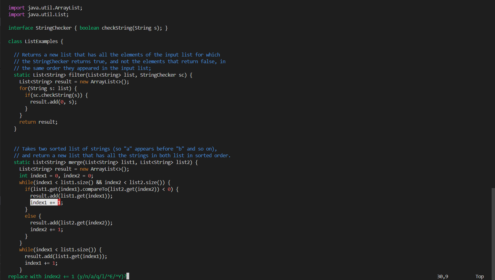
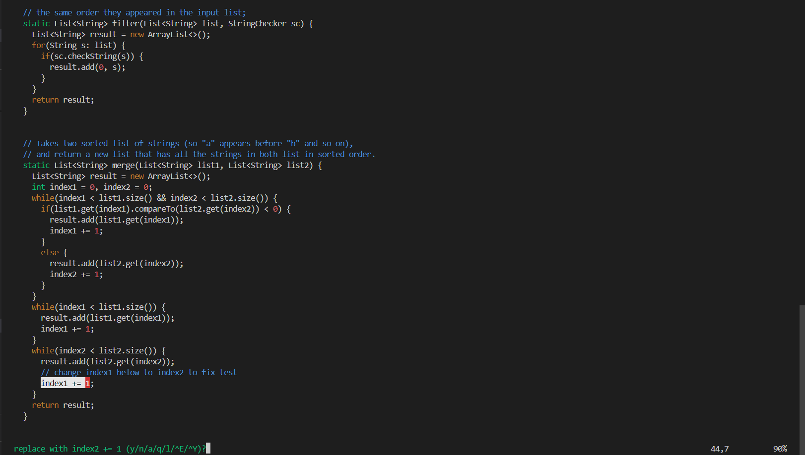
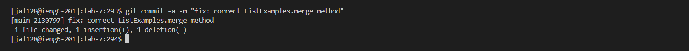
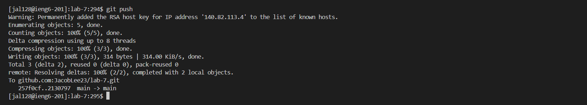

# Lab Report 4

---

## Step 1-3

## Step 4

`$ ssh jal128@ieng6.ucsd.edu`: Logs into the Ieng6 remote machine with the credential `jal128@ieng6.ucsd.edu`.

## Step 5

`$git clone git@github.com:JacobLee23/lab-7.git`: Clones the `JacobLee23/lab-7.git` repository into a new directory via SSH.

## Step 6

`$ bash test.sh`: Executes the `test.sh` shell script using the `bash` command interpreter.

## Step 7

`$ vim ListExamplesTests.java`: Opens *ListExamplesTests.java* with `vim` in normal mode.

`:%s/li, l2/l2, l1/gc` <kbd>ENTER</kbd>: Searches for the string `l1, l2` within the file and replace each instance with the string `l2, l1`, prompting for confirmation before performing each replacement.

`ny`: Skips the first replacement; Performs the second replacement.

`:wq`: Saves the changes made to the file; Exits `vim`.

## Step 8

<kbd>↑</kbd> <kbd>↑</kbd> <kbd>ENTER</kbd>: Executes the command 2 commands back in command execution history, `$ bash test.sh`.

## Step 9

`$ git commit -a -m <message>`: Creates a new commit containing all changed files (`-a`), adding the commit to the local repository log under the commit message `<message>` (`-m <message>`).

`$ git push`: Updates the commit record of the remote repository with the commit record of the local repository.

---

# Relevant XKCD

