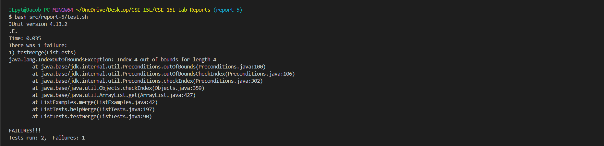
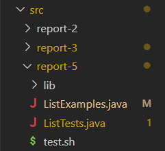
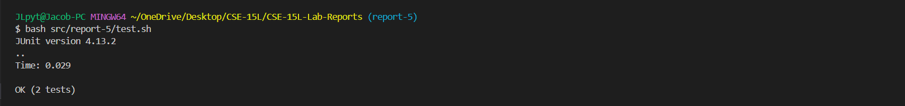

# Lab Report 5

---

## Debugging

---

### Original Post

I am trying to implement a method, `ListExamples.merge` (see `ListExamples.java`), that takes as parameters two `List` objects, each of which is a sorted list of `String` objects, and merges the two lists, returning a `List` object containing a sorted list of `String` objects.

My current implementation (1) iterates over the two lists, compares the next element from each of the two lists, and adds the lesser-valued `String` object to the resultant list. The method repeats (1) until the shorter list has been exhausted. (The first `while` loop in `ListExamples.merge`.) Finally, the method (2) adds all elements remaining in the longer of the two lists. (The second and third `while` loops in `ListExamples.merge`.)

However, when running test cases for `ListExamples.merge` (see `ListTests.java`), an `IndexOutOfBoundsException` exception is thrown. In all the failed cases, given a list of size `n`, the method attempts to access the element at index `n`. So this behavior makes me think that this issue is arising either from the `while` condition(s) or how I am incrementing `index1`/`index2`.



Here is the file hierarchy of my working directory, `src/report-5/`:



Below are the relevant contents of the files relevant to this issue:

[`ListExamples.java`](../src/report-5/ListExamples.java):
```java
import java.util.ArrayList;
import java.util.List;


interface StringChecker { ... }


class ListExamples {

    static List<String> filter(List<String> list, StringChecker sc) { ... }

    static List<String> merge(List<String> list1, List<String> list2) {
        List<String> result = new ArrayList<>();
        int index1 = 0, index2 = 0;

        while (index1 < list1.size() && index2 < list2.size()) {
            if (list1.get(index1).compareTo(list2.get(index2)) < 0) {
                result.add(list1.get(++index1));
            } else {
                result.add(list2.get(++index2));
            }
        }

        while (index1 < list1.size()) {
            result.add(list1.get(++index1));
        }

        while (index2 < list2.size()) {
            result.add(list2.get(++index2));
        }

        return result;
    }

}
```

[`ListTests.java`](../src/report-5/ListTests.java)

```java
import static org.junit.Assert.*;

import java.util.ArrayList;
import java.util.Collections;
import java.util.List;
import org.junit.*;

public class ListTests {

    String[] input0 = {};
    String[] input1 = { "", "\t", "\n", " " };
    String[] input2 = { "a", "b", "c", "d", "e" };
    String[] input3 = { "0", "1", "2", "3", "4", "5" };
    String[] input4 = { "AA", "Aa", "aA", "aa" };
    String[] input5 = { "1", "12", "123", "a", "ab", "abc" };

    @Test
    public void testFilter() { ... }

    public void helpFilter(String[] arrInput, String[] arrOutput, StringChecker sc) { ... }

    @Test
    public void testMerge() {
        this.helpMerge(this.input0, this.input0, this.input0);
        this.helpMerge(this.input0, this.input1, this.input1);
        this.helpMerge(this.input0, this.input2, this.input2);
        this.helpMerge(this.input0, this.input3, this.input3);
        this.helpMerge(this.input0, this.input4, this.input4);
        this.helpMerge(this.input0, this.input5, this.input5);

        this.helpMerge(this.input1, this.input1, new String[] {"", "", "\t", "\t", "\n", "\n", " ", " "});
        this.helpMerge(this.input1, this.input2, new String[] {"", "\t", "\n", " ", "a", "b", "c", "d", "e"});
        this.helpMerge(this.input1, this.input3, new String[] {"", "\t", "\n", " ", "0", "1", "2", "3", "4", "5"});
        this.helpMerge(this.input1, this.input4, new String[] {"", "\t", "\n", " ", "AA", "Aa", "aA", "aa"});
        this.helpMerge(this.input1, this.input5, new String[] {"", "\t", "\n", " ", "1", "12", "123", "a", "ab", "abc"});

        this.helpMerge(this.input2, this.input2, new String[] {"a", "a", "b", "b", "c", "c", "d", "d", "e", "e"});
        this.helpMerge(this.input2, this.input3, new String[] {"0", "1", "2", "3", "4", "5", "a", "b", "c", "d", "e"});
        this.helpMerge(this.input2, this.input4, new String[] {"AA", "Aa", "a", "aA", "aa", "b", "c", "d", "e"});
        this.helpMerge(this.input2, this.input5, new String[] {"1", "12", "123", "a", "a", "ab", "abc", "b", "c", "d", "e"});

        this.helpMerge(this.input3, this.input3, new String[] {"0", "0", "1", "1", "2", "2", "3", "3", "4", "4", "5", "5"});
        this.helpMerge(this.input3, this.input4, new String[] {"0", "1", "2", "3", "4", "5", "AA", "Aa", "aA", "aa"});
        this.helpMerge(this.input3, this.input5, new String[] {"0", "1", "1", "12", "123", "2", "3", "4", "5", "a", "ab", "abc"});

        this.helpMerge(this.input4, this.input4, new String[] {"AA", "AA", "Aa", "Aa", "aA", "aA", "aa", "aa"});
        this.helpMerge(this.input4, this.input5, new String[] {"1", "12", "123", "AA", "Aa", "a", "aA", "aa", "ab", "abc"});

        this.helpMerge(this.input5, this.input5, new String[] {"1", "1", "12", "12", "123", "123", "a", "a", "ab", "ab", "abc", "abc"});
    }

    public void helpMerge(String[] arrInput1, String[] arrInput2, String[] arrOutput) {
        List<String> input1 = new ArrayList<>();
        for (String s: arrInput1) {
            input1.add(s);
        }

        List<String> input2 = new ArrayList<>();
        for (String s: arrInput2) {
            input2.add(s);
        }

        List<String> output = new ArrayList<>();
        for (String s: arrOutput) {
            output.add(s);
        }

        assertEquals(output, ListExamples.merge(input1, input2));
    }

}
```

[`test.sh`](../src/report-5/test.sh)

```bash
#! /bin/bash

cd $( dirname $0 )

javac -cp ".;lib/hamcrest-core-1.3.jar;lib/junit-4.13.2.jar" *.java
java -cp ".;lib/junit-4.13.2.jar;lib/hamcrest-core-1.3.jar" org.junit.runner.JUnitCore ListTests
```

---

### TA Response

I noticed that when incrementing `index1` and `index2` you use the `++` operator (`++index1` and `++index2`, respectively). Remember the is a difference between pre-incrementation (`++x`) and post-incrementation (`x++`). What if instead of using the `++` operator you increment `index1` and `index2` separate from your calls to `result.add` using the `+=` operator? When doing so, should incrementation precede or succeed a call to `result.add`?

---

### Student Response

It appears my issue originated from the difference between pre-incrementation (`++index1`/`++index2`) and post-incrementaiton (`index1++`/`index2++`). Each iteration of each `while` loop should add the element at the specified index in the list then increment the index, which can be done with either post-incrementation or a call to `result.add` followed by incrementation:

```java
class ListExamples {

    static List<String> filter(List<String> list, StringChecker sc) { ... }

    static List<String> merge(List<String> list1, List<String> list2) {
        List<String> result = new ArrayList<>();
        int index1 = 0, index2 = 0;

        while (index1 < list1.size() && index2 < list2.size()) {
            if (list1.get(index1).compareTo(list2.get(index2)) < 0) {
                // result.add(list.get(index1)); index1 += 1;
                result.add(list1.get(index1++));
            } else {
                // result.add(list.get(index2)); index2 += 1;
                result.add(list2.get(index2++));
            }
        }

        while (index1 < list1.size()) {
            // result.add(list.get(index1)); index1 += 1;
            result.add(list1.get(index1++));
        }

        while (index2 < list2.size()) {
            // result.add(list.get(index2)); index2 += 1;
            result.add(list2.get(index2++));
        }

        return result;
    }

}
```

After making the above changes, all tests pass:



---

## Reflection

---

# Relevant XKCD


